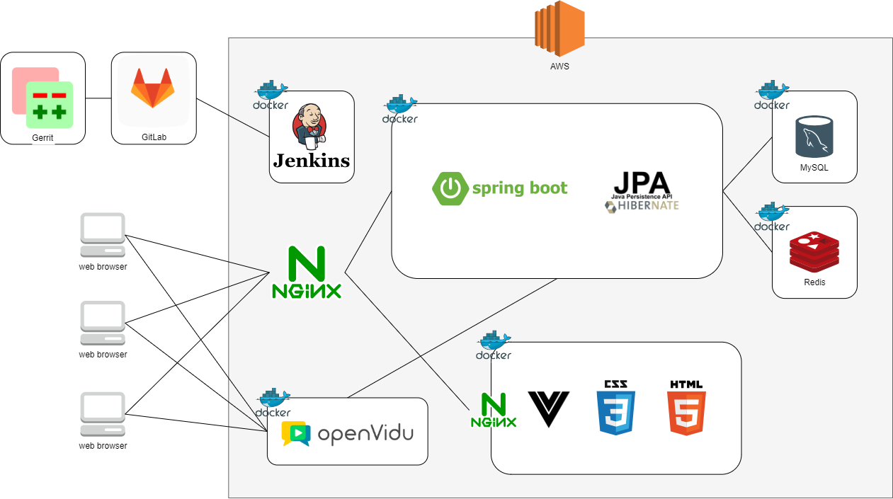
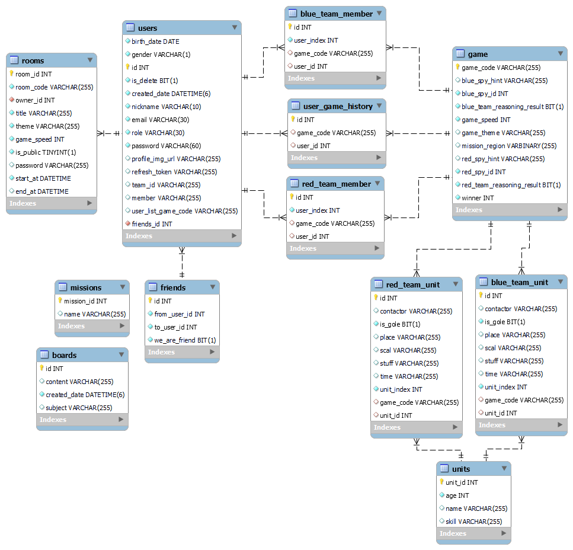
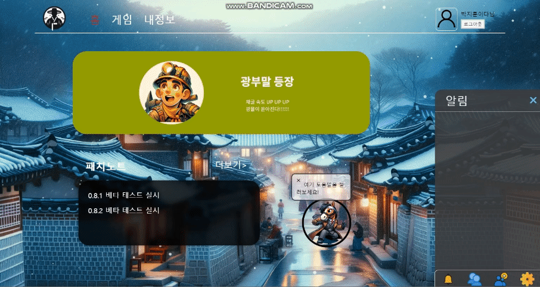

# 배고프면 생각이 안나조 프로젝트

## 🔍프로젝트 소개

### 📌서비스 요약

- 기존 윷놀이 말에 밀정 시스템을 추가하여 색다른 윷놀이를 즐길 수 있다.
- 맵의 특정 위치마다 미션을 설정하여 새로운 흥미 요소를 즐길 수 있다.

### 📌기획 의도

- 두 명 이상의 플레이어가 화상과 음성을 이용하여 상대방과 직접 소통하며 전략 시뮬레이션 게임인 윷놀이를 즐길 수 있다.
- 전통 놀이인 윷놀이에 전략적 요소를 가미하여 더욱 즐거운 게임이 가능하다.
- 경쟁과 협력이 공존하는 게임으로 서로 간의 유대감 증진이 가능하다.

### 📌기술 스택

#### 프론트엔드

    

#### 백엔드

   

#### DB

 

#### 형상관리

 

#### 배포

  

#### 협업도구

   

#### 라이브러리

   

### 📌프로젝트 기간

- 2023.12.28 ~ 2024.02.16

## 🙍팀원 소개

- 김수빈 : 팀장, 프론트엔드
- 양성규 : 프론트엔드
- 이주미 : 프론트엔드
- 이희웅 : 프론트엔드
- 이준희 : 백엔드, 실시간 구현
- 박지훈 : 백엔드, 인프라

## 📑Convention

### 📌Git Commit Convention

#### 1. 커밋 유형

- 커밋 제목 첫 글자는 대문자로 작성하기
  
  | 커밋 유형            | 의미                                       |
  | ---------------- | ---------------------------------------- |
  | Feat             | 새로운 기능 추가                                |
  | Fix              | 버그 수정                                    |
  | Docs             | 문서 수정                                    |
  | Style            | 코드 formatting, 세미콜론 누락, 코드 자체의 변경이 없는 경우 |
  | Refactor         | 코드 리팩토링                                  |
  | Test             | 테스트 코드, 리팩토링 테스트 코드 추가                   |
  | Chore            | 패키지 매니저 수정, 그 외 기타 수정 ex) .gitignore     |
  | Design           | CSS 등 사용자 UI 디자인 변경                      |
  | Comment          | 필요한 주석 추가 및 변경                           |
  | Rename           | 파일 또는 폴더 명을 수정하거나 옮기는 작업만인 경우            |
  | Remove           | 파일을 삭제하는 작업만 수행한 경우                      |
  | !BREAKING CHANGE | 커다란 API 변경의 경우                           |
  | !HOTFIX          | 급하게 치명적인 버그를 고쳐야 하는 경우                   |

#### 2. 제목

- `커밋 유형 태그 : 제목`의 형태이며 제목 첫 글자는 대문자로 작성
- 제목은 최대 50자 이내로 작성하고 마침표 및 특수기호는 사용 금지
- 커밋 유형 이후 제목과 본문은 한글로 작성하여 내용이 잘 전달될 수 있도록 할 것

#### 3. 본문

- 본문에는 변경한 내용과 이유 설명 (How 보다는 What & Why 위주 설명)
- 본문 내용은 양에 구애받지 않고 최대한 상세하게 작성

#### 4. 꼬리말

- 꼬리말은 옵션이므로 `이슈 트래커 ID`를 명시하고 싶을 때 작성
- 꼬리말은 `“유형: #이슈 번호”` 형식으로 사용
- 여러 개의 이슈 번호를 적을 때는 쉼표로 구분
- 이슈 트래커 유형은 다음 중 하나 사용
  - `Fixes`: 이슈 수정중 (아직 해결되지 않은 경우)
  - `Resolveds`: 이슈 해결했을 때 사용
  - `Ref`: 참고할 이슈가 있을 때 사용
  - `Related to`: 해당 커밋에 관련된 이슈 변호 (아직 해결되지 않은 경우)

### 📌Git Branch Convention

#### 규칙

- `master`에서 각자의 기능 브랜치를 분기
  - 프론트(`develop-FE`), 백(`develop-BE`)
- 브랜치 이름 규칙
  - `작업종류/기능` 으로 브랜치 만들기
  - (지라 스토리 이슈 = 기능 명세서 소 분류 = 브랜치 1개)
  - (지라 작업 이슈 = 커밋 1개)
  - `design/FE-logout` `feat/BE-signup` `fix/FE-not-render-nav`
- 해당 기능의 브랜치에 작업이 완료 되면 해당 브랜치를 원격 저장소에 `push`하고 Gerrit 을 이용하여 commit 단위로 리뷰 받기
  - commit 단위로 리뷰를 받았으므로, 추후에 기능 완성 후 로컬에서 프론트와 백 브랜치에 `merge` 이후 충돌 해결한 다음 원격브랜치에 `push`
- `merge request`가 승인되면 `merge된 master` 브랜치에대하여 다시 EC2에서 빌드, 배포 실행 ⇒ MM 혹은 대면으로 결과 알림

#### 주의

- `master` 브랜치로 부터 개발하는 용도 외의 복사본 용을 git clone하여 `master` 브랜치로 부터 계속 pull 받으면서 복사본으로 사용\*\*
- **원격 저장소 `master`에 `merge` 이후 꼭 잊지말고 `master` 에서 `pull` 하기**

## 📌Code Convention

### 백, 프론트 공통 코드 컨벤션

- 메소드 파라미터는 최대 4개 이하

- 함수명, 변수명은 카멜케이스

- 주석은 설명하려는 구문 상단에 맞춰 쓰기
  
  ```java
  function example() {
  ...
    // something에 관한 주석
    something ...
  }
  ```

- 공백으로 구분 잘해주기

### 프론트엔드 코드 컨벤션

**[ 코드 ]**

- 문장마다 Enter하여 가독성 높이기

- 화살표 함수 사용

- 작은 따옴표 사용

- 세미콜론 사용

- 멀티 워드 컴포넌트 이름 사용하기
  
  ```java
  <!-- 사전 컴파일된 템플릿에서 -->
  <TodoItem />
  ```

<!-- in-DOM 템플릿에서 -->

<todo-item></todo-item>

```
- prop 정의는 상세하게, 최소한 타입을 명시하기
```java
// 잘못된 예
const props = defineProps(['status'])
```

```java
// 좋은 예
// 1. 첫번째 예시
const props = defineProps({
    status: String
})

// 2. 두번째 예시 (상세)
const props = defineProps({
    status: {
        type: String,
        required: true,

        validator: (value) => {
                return ['syncing', 'synced', 'version-conflict', 'error'].includes(
                    value
                )
            }
        }
    })
```

**[ 파일명 ]**

- 기초 컴포넌트명에 이어쓰기
  
  ex)
  
  Todo.vue
  
  TodoList.vue
  
  TodoDetailList.vue

- 파스칼 케이스

#### 백엔드 코드 컨벤션

- 모든 변수는 하나의 한개만 선언하기
  
  ```java
  int a, b; // X
  
  int a;
  int b; // O
  ```

- package 이름 : 소문자와 숫자만 사용 `ex) com.example.deepspace`

- Class 이름 : 첫 번째 문자를 대문자로 시작하며, 명사로 작성
  
  ```java
  class Test { }
  
  //단어가 2개 이상 혼합되어 있다면,
  //각 단어의 첫 번째 문자를 대문자로 표현
  class UserInfo { }
  ```

- Interface 이름 : 첫 번째 문자를 대문자 시작
  
  ```java
  interface Runnable { }
  interface ActionListener { }
  ```

- C style 배열선언 금지
  
  ```java
  String[] args // O
  String args[] // X
  ```

- 구현부가 없거나 한 줄의 구문을 포함해도 중괄호를 사용한다.
  
  ```java
  if(a > b) {
  a = b;
  }
  ```

- 상수는 모두 대문자로 작성하며, 단어 사이를 밑줄(\_)로 구분

- 클래스의 멤버와 initializer 의 순서는 따로 없지만, 최대한 논리적인 순서를 따름 새 메서드를 끝에 추가하는 것은 시간순이지 논리적인 순서가 아님

- 빈 블록은 줄바꿈하지 않고 {} 로 사용 multi-block(if/else, try/catch/finally) 은 줄바꿈

- 같은 동일한 이름의 메서드, 생성자는 연속적으로 작성

- @Override: 항상 사용

### 📌Jira Convention

#### 이슈 구조

- `최상단 에픽 이슈` : 개발, 테스트, 배포, 설계 (포인트 x)
- `중단 스토리 이슈` : 유저 스토리 중심의 기능 명세서 소분류 (포인트 x)
- `하단 작업 이슈` : 명세서 소분류의 하위 작업들 (포인트 부여)
  - 이때, 작업 이슈를 따로 만들고 이슈 연결을 해야함
  - 기능적인 측면을 가진 작업 이슈의 경우 최상단 에픽에 바로 연결

#### 이슈 구조 만들기

1. `에픽 이슈` 생성
2. `에픽 이슈`에서 `하위 이슈 추가 버튼` 클릭하여 `스토리 이슈` 생성
3. `작업 이슈`를 따로 생성
4. 2에서 만든 `스토리 이슈`에서 `이슈 연결 버튼` 클릭하여 작업 이슈와 연결

#### 일주일의 스프린트 사용 FLOW

1. `백로그`에 이슈 만들기 - 위 참고
2. `스프린트 만들기`(기간은 그 주 월요일 ~ 일요일)
3. `백로그`에서 만든 이슈(스토리 이슈와 작업 이슈)를 모두 `스프린트`로 옮기기
   1. 이때, `스토리 이슈` 바로 밑에 연결되는 `작업 이슈`를 위치하게 하여 정리하기
4. `스프린트 시작 버튼` 클릭
5. `작업 이슈`에 `진행 중`으로 표시 추가적으로 `진행 중` 표시하고 `포인트 부여`하고 일 시작
6. `작업 이슈`에 해당하는 일이 완료 되면 `완료 표시`하기
   1. 이때 `스토리 이슈`에 해당하는 `모든 작업 이슈`가 완료되면 `스토리 이슈`도 `완료 표시`하기
7. 스프린트 완료 일요일 날 되면 꼭 누르기

#### 추가 주의사항

- 매일 마무리 회의 태스크 추가
- 피치못할 사정이 아닌 이상 금요일에 스프린트 회고 진행

## 📚명세서

### 📌API 명세서

#### HTTPS

| 도메인    | Description        | Method | EndPoint                                                | Request Body                                                                                                        | Response Body                                                                                                                                                                                                                                                                                                                                                                                                                                                                                                                                                                                  | Status                                                         |
| ------ | ------------------ | ------ | ------------------------------------------------------- | ------------------------------------------------------------------------------------------------------------------- | ---------------------------------------------------------------------------------------------------------------------------------------------------------------------------------------------------------------------------------------------------------------------------------------------------------------------------------------------------------------------------------------------------------------------------------------------------------------------------------------------------------------------------------------------------------------------------------------------- | -------------------------------------------------------------- |
| User   | 회원가입               | POST   | /user/join                                              | { email : “String”, nickname : “String”, password : “String”, birthDate : “String”, gender : “String” }             |                                                                                                                                                                                                                                                                                                                                                                                                                                                                                                                                                                                                | 200, “회원가입성공” 400, “회원가입실패”                                    |
| User   | 이메일 중복 체크          | GET    | /user/email/{email}                                     |                                                                                                                     | 200, “사용 가능한 email 입니다.” 400, “이미 존재하는 사용자 email 입니다.”                                                                                                                                                                                                                                                                                                                                                                                                                                                                                                                                         |                                                                |
| User   | 닉네임 중복 체크          | GET    | /user/nickname/{nickname}                               |                                                                                                                     | 200, “사용 가능한 닉네임 입니다.” 400, “이미 존재하는 사용자 닉네임 입니다.”                                                                                                                                                                                                                                                                                                                                                                                                                                                                                                                                             |                                                                |
| User   | 이메일 인증 메일 전송       | POST   | /user/emails/verification-requests                      | @param ?email=””                                                                                                    |                                                                                                                                                                                                                                                                                                                                                                                                                                                                                                                                                                                                | 200                                                            |
| User   | 이메일 인증             | POST   | /user/emails/verification                               | @param ?email=””&code=””                                                                                            |                                                                                                                                                                                                                                                                                                                                                                                                                                                                                                                                                                                                | 200 406                                                        |
| User   | 회원탈퇴               | DELETE | /user/deleat-account                                    |                                                                                                                     |                                                                                                                                                                                                                                                                                                                                                                                                                                                                                                                                                                                                | 200                                                            |
| User   | 로그인                | POST   | /auth/login                                             | { email : String, password : String }                                                                               | { refreshToken : String, accessToken : String }                                                                                                                                                                                                                                                                                                                                                                                                                                                                                                                                                |                                                                |
| User   | 로그아웃               | GET    | /user/logout                                            |                                                                                                                     |                                                                                                                                                                                                                                                                                                                                                                                                                                                                                                                                                                                                | 200                                                            |
| User   | 비밀 번호 찾기 이메일 인증 요청 | POST   | /user/get-temporary-password-email-verification-request | @param ?email=””                                                                                                    |                                                                                                                                                                                                                                                                                                                                                                                                                                                                                                                                                                                                | 200 406                                                        |
| User   | 비밀 번호 찾기 이메일 인증    | POST   | /user/get-temporary-password-email-verification         | @param ?email=””&code=””                                                                                            |                                                                                                                                                                                                                                                                                                                                                                                                                                                                                                                                                                                                | 200 406                                                        |
| User   | 회원 정보 조회           | GET    | /user/info                                              |                                                                                                                     | { “nickname” : string “email” : string “birth_date” : string “gender” : string “profile_url” : string }                                                                                                                                                                                                                                                                                                                                                                                                                                                                                        |                                                                |
| User   | 전적 조회              | GET    | /user/stat                                              |                                                                                                                     | { gameSpeed : int, gameTheme : String, winner : String, blueSpyName : String, redSpyName : String, redSpyHint : String, blueSpyHint : String, redTeamReasoningResult : boolean, blueTeamReasoningResult : boolean, blueTeamMemberDtoList : { nickname : String } redTeamMemberDtoList : { nickname : String } blueTeamUnitDtoList : { name : String. place : String, time : String, contactor : String stuff : String, scal : String skill : String } redTeamUnitDtoList : { name : String. place : String, time : String, contactor : String stuff : String, scal : String skill : String } } |                                                                |
| User   | 비밀 번호 변경           | POST   | /user/change-password                                   | { previousPassword : “String”, nextPassword : “String” }                                                            |                                                                                                                                                                                                                                                                                                                                                                                                                                                                                                                                                                                                | 200, 400                                                       |
| User   | 닉네임 변경             | POST   | /user/change-nickname                                   | String                                                                                                              |                                                                                                                                                                                                                                                                                                                                                                                                                                                                                                                                                                                                | 200                                                            |
| User   | 유저 검색              | GET    | /user/search/{nickname}                                 |                                                                                                                     |                                                                                                                                                                                                                                                                                                                                                                                                                                                                                                                                                                                                | { email : String, nickname : String, }                         |
| Friend | 내 친구 목록            | GET    | /friend/myfriend                                        |                                                                                                                     | { { email : String, nickname : String isOnline : String }, }                                                                                                                                                                                                                                                                                                                                                                                                                                                                                                                                   |                                                                |
| Friend | 친구 요청              | POST   | /friend/send                                            | { toUserEmail : String, toUserNickname : String }                                                                   | 200 “친구 요청 완료” 200 “이미 처리된 요청”                                                                                                                                                                                                                                                                                                                                                                                                                                                                                                                                                                 |                                                                |
| Friend | 친구 수락              | POST   | /friend/accept                                          | { fromUserEmail : String, fromUserNickname : String }                                                               | 200 “요청 수락 완료” 200 “이미 처리된 요청”                                                                                                                                                                                                                                                                                                                                                                                                                                                                                                                                                                 |                                                                |
| Friend | 내 요청 목록            | GET    | /friend/send                                            |                                                                                                                     | { { toUserEmail : String, toUserNickname : String }, }                                                                                                                                                                                                                                                                                                                                                                                                                                                                                                                                         |                                                                |
| Friend | 받은 요청 목록           | GET    | /friend/receive                                         |                                                                                                                     | { { fromUserEmail : String, fromUserNickname : String }, }                                                                                                                                                                                                                                                                                                                                                                                                                                                                                                                                     |                                                                |
| Friend | 요청 거절              | POST   | /friend/reject                                          | { fromUserEmail : String, fromUserNickname : String }                                                               | 200 ”요청 거절 완료”                                                                                                                                                                                                                                                                                                                                                                                                                                                                                                                                                                                 |                                                                |
| Room   | 방 생성               | POST   | /room/create                                            | header : accessToken { "title": string, "isPublic": boolean, "password": string, "theme": string, "speed": number } | room code 반환                                                                                                                                                                                                                                                                                                                                                                                                                                                                                                                                                                                   | 201 - 방 생성 성공 401 - 토큰이 유효하지 않음 404 - 사용자를 찾을 수 없음 500 : 서버 에러 |
| Room   | 방 목록 조회            | GET    | /room                                                   |                                                                                                                     | [ { "roomId": number, ”currentUserCount": number, "title": string, "public": boolean }, { "roomId": number, ”currentUserCount": number, "title": string, "public": boolean } ]                                                                                                                                                                                                                                                                                                                                                                                                                 |                                                                |
| Room   | 방 세부 정보 조회         | GET    | /room/detail/{roomId}                                   |                                                                                                                     | { “title” : string, “isPublic” : boolean, “gameSpeed” : number, “currentUserCount” : number, “theme” : string }                                                                                                                                                                                                                                                                                                                                                                                                                                                                                |                                                                |
| Room   | 방 입장 가능 여부 조회      | POST   | /room/{roomId}                                          | { ”password” : string }                                                                                             | room code를 반환함                                                                                                                                                                                                                                                                                                                                                                                                                                                                                                                                                                                 | 200 - 입장 가능 403 - 인원 수 초과 404 - 유효하지 않은 room id                |
| Board  | 글 목록               | GET    | /board/list                                             |                                                                                                                     | [ { "id": 1, "subject": "String.", "content": "String." ”created_date” : “String” }, { "id": 2, "subject": "String.", "content": "String." ”created_date” : “String” }, { "id": 3, "subject": "String.", "content": "String." ”created_date” : “String” }, { "id": 4, "subject": "String.", "content": "String." ”created_date” : “String” }, { "id": 5, "subject": "String.", "content": "String." ”created_date” : “String” } ]                                                                                                                                                              |                                                                |

#### wss pub

| 도메인    | Description       | EndPoint                               | Request Body                                                                                                       | Response Body                                                                                                                                                                                                                                                                                                                                                                                                                                                                                                                                                                                                                                                                                                                                                                                                                                                                                                                                                                                                                                                                                                                                                                                                                                                                                                                                                                                                                                                                                                                                                                                                                                                                                                                                                                                                                                                                                                                                                                                                                                                                                                                                                                                                                                                                                                                                                                                                                                                                                                                                                       |
| ------ | ----------------- | -------------------------------------- | ------------------------------------------------------------------------------------------------------------------ | ------------------------------------------------------------------------------------------------------------------------------------------------------------------------------------------------------------------------------------------------------------------------------------------------------------------------------------------------------------------------------------------------------------------------------------------------------------------------------------------------------------------------------------------------------------------------------------------------------------------------------------------------------------------------------------------------------------------------------------------------------------------------------------------------------------------------------------------------------------------------------------------------------------------------------------------------------------------------------------------------------------------------------------------------------------------------------------------------------------------------------------------------------------------------------------------------------------------------------------------------------------------------------------------------------------------------------------------------------------------------------------------------------------------------------------------------------------------------------------------------------------------------------------------------------------------------------------------------------------------------------------------------------------------------------------------------------------------------------------------------------------------------------------------------------------------------------------------------------------------------------------------------------------------------------------------------------------------------------------------------------------------------------------------------------------------------------------------------------------------------------------------------------------------------------------------------------------------------------------------------------------------------------------------------------------------------------------------------------------------------------------------------------------------------------------------------------------------------------------------------------------------------------------------------------------------- |
| Room   | 방 입장              | /pub/room/{roomCode}/enter             | { destination : /pub/room/{roomCode}/enter body : email }                                                          | { "type":"ROOM_ENTER_INFO", "code":string "data":{ "ownerId":number, "currentSeatDtoList":[ {"team":1,"seatNumber":0,"userId":0,"nickname":null,"profileImgUrl":null,"state":0,"ready":false}, {"team":1,"seatNumber":1,"userId":0,"nickname":null,"profileImgUrl":null,"state":0,"ready":false}, {"team":1,"seatNumber":2,"userId":0,"nickname":null,"profileImgUrl":null,"state":0,"ready":false}, {"team":2,"seatNumber":3,"userId":0,"nickname":null,"profileImgUrl":null,"state":0,"ready":false}, {"team":2,"seatNumber":4,"userId":0,"nickname":null,"profileImgUrl":null,"state":0,"ready":false}, {"team":2,"seatNumber":5,"userId":0,"nickname":null,"profileImgUrl":null,"state":0,"ready":false}], "roomDetailDto":{ "title":string, "gameSpeed":number, "currentUserCount":number, "theme":string, "public":boolean }, "message": string “roomState” : 방이 삭제되지 않았더라면 0, 방이 삭제 되었다면 1 } }                                                                                                                                                                                                                                                                                                                                                                                                                                                                                                                                                                                                                                                                                                                                                                                                                                                                                                                                                                                                                                                                                                                                                                                                                                                                                                                                                                                                                                                                                                                                                                                                                                                               |
| Room   | 방 나가기 (방장이면 방 삭제) | /pub/room/{roomCode}/exit              | { destination : /pub/room/{roomCode}/enter body : email }                                                          | { "type":"ROOM_EXIT_INFO", "code":string, "data":{ "ownerId":number, "currentSeatDtoList":[ {"team":1,"seatNumber":0,"userId":0,"nickname":null,"profileImgUrl":null,"state":0,"ready":false}, {"team":1,"seatNumber":1,"userId":0,"nickname":null,"profileImgUrl":null,"state":0,"ready":false}, {"team":1,"seatNumber":2,"userId":0,"nickname":null,"profileImgUrl":null,"state":0,"ready":false}, {"team":2,"seatNumber":3,"userId":0,"nickname":null,"profileImgUrl":null,"state":0,"ready":false}, {"team":2,"seatNumber":4,"userId":0,"nickname":null,"profileImgUrl":null,"state":0,"ready":false}, {"team":2,"seatNumber":5,"userId":0,"nickname":null,"profileImgUrl":null,"state":0,"ready":false}], "roomDetailDto":{ "title":string, "gameSpeed":number, "currentUserCount":number, "theme":string, "public":boolean }, "message":string “roomState” : 방이 삭제되지 않았더라면 0, 방이 삭제 되었다면 1 } }                                                                                                                                                                                                                                                                                                                                                                                                                                                                                                                                                                                                                                                                                                                                                                                                                                                                                                                                                                                                                                                                                                                                                                                                                                                                                                                                                                                                                                                                                                                                                                                                                                                                |
| Room   | 방 채팅              | /pub/room/{roomCode}/chat              | body : { nickname : string message : string }                                                                      | { "type":"ROOM_CHAT", "code":string, "data":{ "nickname":string, "message":"string" } }                                                                                                                                                                                                                                                                                                                                                                                                                                                                                                                                                                                                                                                                                                                                                                                                                                                                                                                                                                                                                                                                                                                                                                                                                                                                                                                                                                                                                                                                                                                                                                                                                                                                                                                                                                                                                                                                                                                                                                                                                                                                                                                                                                                                                                                                                                                                                                                                                                                                             |
| Room   | 방 준비완료            | /pub/room/{roomCode}/ready             | { destination : /pub/room/{roomCode}/ready body : email }                                                          | { "type":"ROOM_READY", "code":string, "data"[ {"team":1,"seatNumber":0,"userId":1,"nickname":”참여자1","profileImgUrl":null,"state":0,"ready":true}, {"team":1,"seatNumber":1,"userId":45,"nickname":”참여자2”,"profileImgUrl":null,"state":0,"ready":false}, {"team":1,"seatNumber":2,"userId":7,"nickname":”참여자3”,"profileImgUrl":null,"state":0,"ready":false}, {"team":2,"seatNumber":3,"userId":19,"nickname":””참여자4”,"profileImgUrl":null,"state":0,"ready":true}, {"team":2,"seatNumber":4,"userId":25,"nickname":”참여자5”,"profileImgUrl":null,"state":0,"ready":true}, {"team":2,"seatNumber":5,"userId":34,"nickname":”참여자6”,"profileImgUrl":null,"state":0,"ready":false} ] }                                                                                                                                                                                                                                                                                                                                                                                                                                                                                                                                                                                                                                                                                                                                                                                                                                                                                                                                                                                                                                                                                                                                                                                                                                                                                                                                                                                                                                                                                                                                                                                                                                                                                                                                                                                                                                                                                    |
| Room   | 방 팀 변경            | /pub/room/{roomCode}/change            | { destination : /pub/room/{roomCode}/change body : email }                                                         | { "type":"ROOM_CHANGE_TEAM", "code":string, "data"[ {"team":1,"seatNumber":0,"userId":1,"nickname":”참여자1","profileImgUrl":null,"state":0,"ready":true}, {"team":1,"seatNumber":1,"userId":45,"nickname":”참여자2”,"profileImgUrl":null,"state":0,"ready":false}, {"team":1,"seatNumber":2,"userId":7,"nickname":”참여자3”,"profileImgUrl":null,"state":0,"ready":false}, {"team":2,"seatNumber":3,"userId":19,"nickname":””참여자4”,"profileImgUrl":null,"state":0,"ready":true}, {"team":2,"seatNumber":4,"userId":25,"nickname":”참여자5”,"profileImgUrl":null,"state":0,"ready":true}, {"team":2,"seatNumber":5,"userId":34,"nickname":”참여자6”,"profileImgUrl":null,"state":0,"ready":false} ] }                                                                                                                                                                                                                                                                                                                                                                                                                                                                                                                                                                                                                                                                                                                                                                                                                                                                                                                                                                                                                                                                                                                                                                                                                                                                                                                                                                                                                                                                                                                                                                                                                                                                                                                                                                                                                                                                              |
| Room   | 방 시작 (캐릭터 창으로 이동) | /pub/room/{roomCode}/start             | { destination : /pub/room/{roomCode}/start body : email }                                                          | { "type":"ROOM_START_PICK", "code":string, "data":”캐릭터 선택 시작” }                                                                                                                                                                                                                                                                                                                                                                                                                                                                                                                                                                                                                                                                                                                                                                                                                                                                                                                                                                                                                                                                                                                                                                                                                                                                                                                                                                                                                                                                                                                                                                                                                                                                                                                                                                                                                                                                                                                                                                                                                                                                                                                                                                                                                                                                                                                                                                                                                                                                                                     |
| Pick   | 캐릭터 픽 전 사전 정보 전달  | /pub/pick/{roomCode}/get-pre-info      | { destination : /pub/pick/{roomCode}/get-pre-info }                                                                | 홍팀 일 경우 { "type":"PICK_GET_PRE_INFO", "code":"232618/red", "data":{ "userInfo"[ {"team":1,"seatNumber":0,"userId":2,"nickname":"주니","selectUnitId":0,”pick":false}, {"team":1,"seatNumber":1,"userId":26,"nickname":"테스트1","selectUnitId":0,”pick":false}, {"team":1,"seatNumber":2,"userId":27,"nickname":"테스트2","selectUnitId":0,”pick":false} ], "unitInfo":[ {"unitId":1,"name":"대왕","age":40,"skill":"밀정면역","pick":false}, {"unitId":2,"name":"창병","age":30,"skill":"기절","pick":false}, {"unitId":3,"name":"기병","age":32,"skill":"치명적속도","pick":false}, {"unitId":4,"name":"농민","age":24,"skill":"농민도스킬이쓰고싶어요","pick":true}, {"unitId":5,"name":"노비","age":33,"skill":"노비의무게","pick":true} ] } } 청팀 일 경우 { "type":"PICK_GET_PRE_INFO", "code":"232618/blue", "data":{ "userInfo"[ {"team":2,"seatNumber":3,"userId":46,"nickname":"참여자4","selectUnitId":0,”pick":false}, {"team":2,"seatNumber":4,"userId":52,"nickname":"참여자5","selectUnitId":0,”pick":false}, {"team":2,"seatNumber":5,"userId":27,"nickname":"참여자6","selectUnitId":0,”pick":false} ], "unitInfo":[ {"unitId":1,"name":"대왕","age":40,"skill":"밀정면역","pick":false}, {"unitId":2,"name":"창병","age":30,"skill":"기절","pick":false}, {"unitId":3,"name":"기병","age":32,"skill":"치명적속도","pick":false}, {"unitId":4,"name":"농민","age":24,"skill":"농민도스킬이쓰고싶어요","pick":true}, {"unitId":5,"name":"노비","age":33,"skill":"노비의무게","pick":true} ] } }                                                                                                                                                                                                                                                                                                                                                                                                                                                                                                                                                                                                                                                                                                                                                                                                                                                                                                                                                                                                                                                                                                                                                     |
| Pick   | 캐릭터 픽 시작          | /pub/pick/{roomCode}/start             | { destination : /pub/pick/{roomCode}/start }                                                                       | 홍팀 일 경우 { "type":"PICK_ORDER", "code":"232618/red", "data":{ email : “픽을 해야하는 유저의 이메일”, time : 타이머 시간 } } 청팀 일 경우 { "type":"PICK_ORDER", "code":"232618/blue", "data":{ email : “픽을 해야하는 유저의 이메일”, time : 타이머 시간 } }                                                                                                                                                                                                                                                                                                                                                                                                                                                                                                                                                                                                                                                                                                                                                                                                                                                                                                                                                                                                                                                                                                                                                                                                                                                                                                                                                                                                                                                                                                                                                                                                                                                                                                                                                                                                                                                                                                                                                                                                                                                                                                                                                                                                                                                                                                                                                |
| Pick   | 캐릭터 픽 선택          | /pub/pick/{roomCode}/select            | { destination: /pub/pick/{roomCode}/select body:{ team: “홍팀” or “청팀”, email : 선택한 유저의 이메일, unitId : 선택한 유닛 아이디 } } | 홍팀 일 경우 { "type":"PICK_SELECT", "code":"232618/red", "data":{ "userInfo"[ {"team":1,"seatNumber":0,"userId":2,"nickname":"주니","selectUnitId":0,”pick":false}, {"team":1,"seatNumber":1,"userId":26,"nickname":"테스트1","selectUnitId":0,”pick":false}, {"team":1,"seatNumber":2,"userId":27,"nickname":"테스트2","selectUnitId":0,”pick":false} ] } } 청팀 일 경우 { "type":"PICK_SELECT", "code":"232618/blue", "data":{ "userInfo"[ {"team":2,"seatNumber":3,"userId":46,"nickname":"참여자4","selectUnitId":0,”pick":false}, {"team":2,"seatNumber":4,"userId":52,"nickname":"참여자5","selectUnitId":0,”pick":false}, {"team":2,"seatNumber":5,"userId":27,"nickname":"참여자6","selectUnitId":0,”pick":false} ] } }                                                                                                                                                                                                                                                                                                                                                                                                                                                                                                                                                                                                                                                                                                                                                                                                                                                                                                                                                                                                                                                                                                                                                                                                                                                                                                                                                                                                                                                                                                                                                                                                                                                                                                                                                                                                                                                               |
| Pick   | 캐릭터 픽 선택 완료       | /pub/pick/{roomCode}/done              | { destination: /pub/pick/{roomCode}/done body:{ team: “홍팀” or “청팀”, email : 선택한 유저의 이메일, unitId : 선택한 유닛 아이디 } }   | 양팀 픽이 끝나지 않았다면 { "type":"PICK_NEXT", "code":"232618/red", "data":{ email : “픽을 해야하는 유저의 이메일”, time : 타이머 시간 } } 한 팀만 픽이 끝났다면 { "type":"PICK_WAIT", "code":"232618/red", "data": “모든 픽이 완료될 때까지 기다려주세요.” } 양팀 다 픽이 끝났다면 { "type":"PICK_SELECT_SPY", "code":"232618/red", “data”: [ {"unitId":1,"name":"대왕","age":40,"skill":"","pick":true}, {"unitId":2,"name":"창병","age":30,"skill":"","pick":true}, {"unitId":3,"name":"기병","age":32,"skill":"","pick":true}, {"unitId":4,"name":"농민","age":24,"skill":"","pick":true}, {"unitId":5,"name":"노비","age":33,"skill":"","pick":true} ] } 픽 한 정보 전달 (무조건) { "type":"PICK_SELECT_DONE", "code":"232618/red", "data":{ "userInfo"[ {"team":1,"seatNumber":0,"userId":2,"nickname":"주니","selectUnitId":0,”pick":false}, {"team":1,"seatNumber":1,"userId":26,"nickname":"테스트1","selectUnitId":0,”pick":false}, {"team":1,"seatNumber":2,"userId":27,"nickname":"테스트2","selectUnitId":0,”pick":false} ], "unitInfo":[ {"unitId":1,"name":"대왕","age":40,"skill":"밀정면역","pick":false}, {"unitId":2,"name":"창병","age":30,"skill":"기절","pick":false}, {"unitId":3,"name":"기병","age":32,"skill":"치명적속도","pick":false}, {"unitId":4,"name":"농민","age":24,"skill":"농민도스킬이쓰고싶어요","pick":true}, {"unitId":5,"name":"노비","age":33,"skill":"노비의무게","pick":true} ] } }                                                                                                                                                                                                                                                                                                                                                                                                                                                                                                                                                                                                                                                                                                                                                                                                                                                                                                                                                                                                                                                                                                                                                                                                                                                                 |
| Pick   | 밀정 픽 완료           | /pub/pick/{roomCode}/spy               | { destination: /pub/pick/{roomCode}/spy body:{ team: “홍팀” or “청팀”, unitId: number } }                              | 한 팀만 보냈을 경우 { "type":"PICK_SPY_WAIT", "code":"232618/red", "data": “모든 픽이 완료될 때까지 기다려주세요.” } 두 팀 모두 보냈을 경우 홍팀 일 경우 (홍팀 하나만 명세, 블루팀도 동일) { "type":"GAME_START", "code":"232618/red", “data”: [ “EnemySpyInfo” : unitId, “allUserInfo”:[ {"team":1,"seatNumber":0,"userId":1,"nickname":”참여자1","profileImgUrl":null,"state":0,"ready":true}, {"team":1,"seatNumber":1,"userId":45,"nickname":”참여자2”,"profileImgUrl":null,"state":0,"ready":false}, {"team":1,"seatNumber":2,"userId":7,"nickname":”참여자3”,"profileImgUrl":null,"state":0,"ready":false}, {"team":2,"seatNumber":3,"userId":19,"nickname":””참여자4”,"profileImgUrl":null,"state":0,"ready":true}, {"team":2,"seatNumber":4,"userId":25,"nickname":”참여자5”,"profileImgUrl":null,"state":0,"ready":true}, {"team":2,"seatNumber":5,"userId":34,"nickname":”참여자6”,"profileImgUrl":null,"state":0,"ready":false} ], “redTeamUnitList”:[ {"unitId":1,"name":"대왕","age":40,"skill":"","pick":true}, {"unitId":2,"name":"창병","age":30,"skill":"","pick":true}, {"unitId":3,"name":"기병","age":32,"skill":"","pick":true}, {"unitId":4,"name":"농민","age":24,"skill":"","pick":true}, {"unitId":5,"name":"노비","age":33,"skill":"","pick":true} ] “blueTeamUnitList”:[ {"unitId":1,"name":"대왕","age":40,"skill":"","pick":true}, {"unitId":2,"name":"창병","age":30,"skill":"","pick":true}, {"unitId":3,"name":"기병","age":32,"skill":"","pick":true}, {"unitId":4,"name":"농민","age":24,"skill":"","pick":true}, {"unitId":5,"name":"노비","age":33,"skill":"","pick":true} ] ] }                                                                                                                                                                                                                                                                                                                                                                                                                                                                                                                                                                                                                                                                                                                                                                                                                                                                                                                                                                                                                                         |
| Pick   | 캐릭터 선택 채팅창        | /pub/pick/{roomCode}/chat              | { destination: /pub/pick/{roomCode}/done body:{ team: “홍팀” or “청팀”, nickname: string, message: string } }          | { "type":"PICK_.CHAT", "code":"232618/red", “data”: [ team: “홍팀” or “청팀”, nickname: string, message: string ] }                                                                                                                                                                                                                                                                                                                                                                                                                                                                                                                                                                                                                                                                                                                                                                                                                                                                                                                                                                                                                                                                                                                                                                                                                                                                                                                                                                                                                                                                                                                                                                                                                                                                                                                                                                                                                                                                                                                                                                                                                                                                                                                                                                                                                                                                                                                                                                                                                                                     |
| Event  | 이벤트 보내기           | /pub/event                             | { fromUserEmail : String, toUserEmail : String, eventCategory : String, eventAction : String, message : String }   |                                                                                                                                                                                                                                                                                                                                                                                                                                                                                                                                                                                                                                                                                                                                                                                                                                                                                                                                                                                                                                                                                                                                                                                                                                                                                                                                                                                                                                                                                                                                                                                                                                                                                                                                                                                                                                                                                                                                                                                                                                                                                                                                                                                                                                                                                                                                                                                                                                                                                                                                                                     |
| Game   | 게임 시작             | /pub/game/{roomCode}/start             |                                                                                                                    | { actionCategory : 0, missionRegion : {0, 0, 0, 0}, gameSpeed : int, gameTheme : String, redTeamUserList : [ { "unitId" : 1, "name" : "대왕", "skill" : “String”, “place” : “String”, "time” : “String", “contactor” : “String”, “stuff” : “String”, “scal” : “String” }, { "unitId" : 2, "name" : "기병", "skill" : “String”, “place” : “String”, "time” : “String", “contactor” : “String”, “stuff” : “String”, “scal” : “String” }, { "unitId" : 3, "name" : "창병", "skill" : “String”, “place” : “String”, "time” : “String", “contactor” : “String”, “stuff” : “String”, “scal” : “String” }, { "unitId" : 4, "name" : "농민", "skill" : “String”, “place” : “String”, "time” : “String", “contactor” : “String”, “stuff” : “String”, “scal” : “String” }, { "unitId" : 5, "name" : "노비", "skill" : “String”, “place” : “String”, "time” : “String", “contactor” : “String”, “stuff” : “String”, “scal” : “String” } ], blueTeamUserList: : [ { "unitId" : 1, "name" : "대왕", "skill" : “String”, “place” : “String”, "time” : “String", “contactor” : “String”, “stuff” : “String”, “scal” : “String” }, { "unitId" : 2, "name" : "기병", "skill" : “String”, “place” : “String”, "time” : “String", “contactor” : “String”, “stuff” : “String”, “scal” : “String” }, { "unitId" : 3, "name" : "창병", "skill" : “String”, “place” : “String”, "time” : “String", “contactor” : “String”, “stuff” : “String”, “scal” : “String” }, { "unitId" : 4, "name" : "농민", "skill" : “String”, “place” : “String”, "time” : “String", “contactor” : “String”, “stuff” : “String”, “scal” : “String” }, { "unitId" : 5, "name" : "노비", "skill" : “String”, “place” : “String”, "time” : “String", “contactor” : “String”, “stuff” : “String”, “scal” : “String” } ], redTeamUserList: [ {”email” : “String”, “nickname” : “String”, “profileImg” : “String”}, {”email” : “String”, “nickname” : “String”, “profileImg” : “String”}, {”email” : “String”, “nickname” : “String”, “profileImg” : “String”}, {”email” : “String”, “nickname” : “String”, “profileImg” : “String”}, {”email” : “String”, “nickname” : “String”, “profileImg” : “String”} ], blueTeamUserList: [ {”email” : “String”, “nickname” : “String”, “profileImg” : “String”}, {”email” : “String”, “nickname” : “String”, “profileImg” : “String”}, {”email” : “String”, “nickname” : “String”, “profileImg” : “String”}, {”email” : “String”, “nickname” : “String”, “profileImg” : “String”}, {”email” : “String”, “nickname” : “String”, “profileImg” : “String”} ], mySpyUnitId : int, mySqyHint : String } |
| Game   | 윷던지기              | /pub/game/{roomCode}/throw-yut         | { yutRes : number, throwRes : {true,true,true,true}, }                                                             | { actionCategory : 1 yutRes : number, throwRes : {true,true,true,true}, }                                                                                                                                                                                                                                                                                                                                                                                                                                                                                                                                                                                                                                                                                                                                                                                                                                                                                                                                                                                                                                                                                                                                                                                                                                                                                                                                                                                                                                                                                                                                                                                                                                                                                                                                                                                                                                                                                                                                                                                                                                                                                                                                                                                                                                                                                                                                                                                                                                                                                           |
| Game   | 말선택               | /pub/game/{roomCode}/select-unit       | { unitIndex : number, }                                                                                            | { actionCategory : 2, unitIndex : number }                                                                                                                                                                                                                                                                                                                                                                                                                                                                                                                                                                                                                                                                                                                                                                                                                                                                                                                                                                                                                                                                                                                                                                                                                                                                                                                                                                                                                                                                                                                                                                                                                                                                                                                                                                                                                                                                                                                                                                                                                                                                                                                                                                                                                                                                                                                                                                                                                                                                                                                          |
| Game   | 추리                | /pub/game/{roomCode}/reasoning         | { team : number selectedUnit : number }                                                                            | { actionCategory : 3, selectedUnit : number, isSpy : boolean }                                                                                                                                                                                                                                                                                                                                                                                                                                                                                                                                                                                                                                                                                                                                                                                                                                                                                                                                                                                                                                                                                                                                                                                                                                                                                                                                                                                                                                                                                                                                                                                                                                                                                                                                                                                                                                                                                                                                                                                                                                                                                                                                                                                                                                                                                                                                                                                                                                                                                                      |
| Game   | 추리권 사용여부          | /pub/game/{roomCode}/reason-ticket-use | { reasoningChoose : boolean }                                                                                      | { actionCategory : 4, reasoningChoose : boolean }                                                                                                                                                                                                                                                                                                                                                                                                                                                                                                                                                                                                                                                                                                                                                                                                                                                                                                                                                                                                                                                                                                                                                                                                                                                                                                                                                                                                                                                                                                                                                                                                                                                                                                                                                                                                                                                                                                                                                                                                                                                                                                                                                                                                                                                                                                                                                                                                                                                                                                                   |
| Game   | 말도착               | /pub/game/{roomCode}/unit-gole         | { team : int unitId: int[] }                                                                                       | { actionCategory : 5 team : int unitIds : int[] isSpy : boolean spyId : int }                                                                                                                                                                                                                                                                                                                                                                                                                                                                                                                                                                                                                                                                                                                                                                                                                                                                                                                                                                                                                                                                                                                                                                                                                                                                                                                                                                                                                                                                                                                                                                                                                                                                                                                                                                                                                                                                                                                                                                                                                                                                                                                                                                                                                                                                                                                                                                                                                                                                                       |
| Game   | 미션성공 후 힌트 얻기      | /pub/game/{roomCode}/hint              | { team : int, unitId : int, }                                                                                      | { actionCategory : 10 team : int, unitId : int, hint : String category : int, }                                                                                                                                                                                                                                                                                                                                                                                                                                                                                                                                                                                                                                                                                                                                                                                                                                                                                                                                                                                                                                                                                                                                                                                                                                                                                                                                                                                                                                                                                                                                                                                                                                                                                                                                                                                                                                                                                                                                                                                                                                                                                                                                                                                                                                                                                                                                                                                                                                                                                     |
| Game   | 게임종료              | /pub/game/{roomCode}/finish            | { team : int }                                                                                                     | { actionCategory : 9 team : int }                                                                                                                                                                                                                                                                                                                                                                                                                                                                                                                                                                                                                                                                                                                                                                                                                                                                                                                                                                                                                                                                                                                                                                                                                                                                                                                                                                                                                                                                                                                                                                                                                                                                                                                                                                                                                                                                                                                                                                                                                                                                                                                                                                                                                                                                                                                                                                                                                                                                                                                                   |
| Game   | 팀 채팅              | /pub/game/{roomCode}/chat              | { team : “홍팀” or “청팀”, nickname : string, message : string }                                                       | { actionCategory : 6, team : “홍팀” or “청팀”, nickname : string, message : string }                                                                                                                                                                                                                                                                                                                                                                                                                                                                                                                                                                                                                                                                                                                                                                                                                                                                                                                                                                                                                                                                                                                                                                                                                                                                                                                                                                                                                                                                                                                                                                                                                                                                                                                                                                                                                                                                                                                                                                                                                                                                                                                                                                                                                                                                                                                                                                                                                                                                                    |
| Game   | 미니 게임 시작          | /pub/game/{roomCode}/mini-game-start   | { email : 미션 걸린 사람의 email }                                                                                        | { actionCatergory : 7, email : 미션 걸린 사람의 email }                                                                                                                                                                                                                                                                                                                                                                                                                                                                                                                                                                                                                                                                                                                                                                                                                                                                                                                                                                                                                                                                                                                                                                                                                                                                                                                                                                                                                                                                                                                                                                                                                                                                                                                                                                                                                                                                                                                                                                                                                                                                                                                                                                                                                                                                                                                                                                                                                                                                                                                    |
| Game   | 미니 게임 종료          | /pub/game/{roomCode}/mini-game-finish  | { email : 미션 걸린 사람의 email result : 미션 결과 }                                                                         | { actionCatergory : 8, email : 미션 걸린 사람의 email result : 미션 결과 }                                                                                                                                                                                                                                                                                                                                                                                                                                                                                                                                                                                                                                                                                                                                                                                                                                                                                                                                                                                                                                                                                                                                                                                                                                                                                                                                                                                                                                                                                                                                                                                                                                                                                                                                                                                                                                                                                                                                                                                                                                                                                                                                                                                                                                                                                                                                                                                                                                                                                                     |
| Login  | 로그인 알림            | /pub/login                             | { fromUserEmail : String, eventCategory : String, message : String }                                               |                                                                                                                                                                                                                                                                                                                                                                                                                                                                                                                                                                                                                                                                                                                                                                                                                                                                                                                                                                                                                                                                                                                                                                                                                                                                                                                                                                                                                                                                                                                                                                                                                                                                                                                                                                                                                                                                                                                                                                                                                                                                                                                                                                                                                                                                                                                                                                                                                                                                                                                                                                     |
| Logout | 로그아웃알림            | /pub/logout                            | { fromUserEmail : String, eventCategory : String, message : String }                                               |                                                                                                                                                                                                                                                                                                                                                                                                                                                                                                                                                                                                                                                                                                                                                                                                                                                                                                                                                                                                                                                                                                                                                                                                                                                                                                                                                                                                                                                                                                                                                                                                                                                                                                                                                                                                                                                                                                                                                                                                                                                                                                                                                                                                                                                                                                                                                                                                                                                                                                                                                                     |

#### WSS sub

| 도메인   | Description | EndPoint                                           |
| ----- | ----------- | -------------------------------------------------- |
| Room  | 방 입장 (방 구독) | /sub/room/{roomCode}                               |
| Room  | 팀 구독        | /sub/room/{roomCode}/red /sub/room/{roomCode}/blue |
| Event | 이벤트 구독      | /sub/event /user/sub/event                         |
| Game  | 게임 구독       | /sub/game/{roomCode}                               |

## 🔧설계

### 📌아키텍처 설계



### 📌DB 설계 (ERD)



## 💻실제 화면

#### 📌진입 화면

##### 회원가입


##### 로그인


#### 📌홈 화면

##### 홈 화면 진입 후 로그아웃


##### 도움말



##### 게임 관련 설정창 조작


##### 친구 추가


##### 친구 채팅


#### 📌프로필 화면

##### 프로필 홈화면


##### 닉네임 변경


#### 📌게임 방 화면

##### 게임 방 리스트 및 대기 방 입장


#### 📌게임 진행

##### 게임 시작 시 캐릭터 픽 창 진입


##### 캐릭터 픽 이후 상대 팀 밀정 픽 창 진입


##### 게임 시작


##### 윷 던지기


##### 미니 게임 성공 후 밀정 힌트 얻기


##### 밀정 추리


## 🌐 출처

"**Beautiful Korea(뷰티플 코리아)**" 사운드는 윤영현에 의해 제작되었으며, CC BY 라이선스에 따라 사용되었습니다.  
"**BLACK BOX - South Korea**" 사운드는 이지빈에 의해 제작되었으며, CC BY 라이선스에 따라 사용되었습니다.  
"**74. Blumenlied (Flower Song)_ 꽃노래_국악**" 사운드는 한국저작권위원회에 의해 제작되었으며, CC BY 라이선스에 따라 사용되었습니다.  
"**LSMBG0701_궁궐에서 맞이하는 아침**" 사운드는 한국저작권위원회에 의해 제작되었으며, CC BY 라이선스에 따라 사용되었습니다.  
"**Once upon a time**" 사운드는 eldlofi에 의해 의해 제작되었습니다.  
